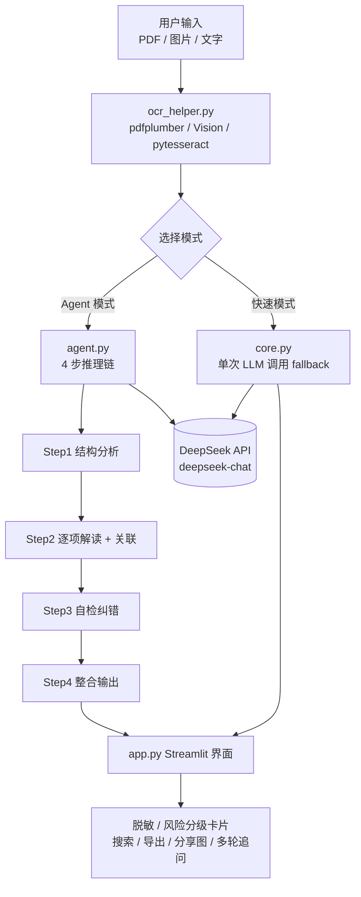

# 体检报告解读助手

> AI 驱动的体检报告解读工具 —— 帮普通人看懂体检报告，识别异常指标，给出通俗解释和就医建议。

## 功能亮点

- **多格式输入**：支持 PDF / 图片上传（自动 OCR）或直接粘贴文字
- **Agent 4 步推理**：结构分析 → 逐项解读 + 交叉关联 → 自检纠错 → 整合输出
- **风险分级卡片**：异常指标按「警惕 / 关注 / 注意」三级配色，一眼看出轻重缓急
- **指标关联分析**：自动发现多指标关联风险（如血糖高 + 血脂高 → 代谢综合征）
- **多轮追问**：解读完成后可基于报告上下文持续追问
- **隐私保护**：身份证号 / 手机号自动脱敏，支持一键隐藏个人信息
- **分享图导出**：一键生成 PNG 摘要图，方便转发给家人
- **移动端适配**：480px / 768px 双断点，手机也能流畅使用

## 技术架构



**技术栈**：Python / Streamlit / DeepSeek API / pdfplumber / pytesseract / html2canvas

## 项目演示

> 典型使用流程：上传一份体检报告 PDF → 自动 OCR 提取文字 → Agent 4 步推理生成带风险分级的解读 → 异常指标自动脱敏、可一键导出分享图。
>
> 截图 / 演示 GIF 建议放在 `docs/` 目录下，并在下方补充：
> - `docs/demo-upload.png` —— 上传与 OCR 结果
> - `docs/demo-report.png` —— 风险分级解读卡片
> - `docs/demo-redact.png` —— 隐私脱敏与分享图导出
>
> （当前仓库未包含演示素材，部署后在 README 顶部补一张主界面截图可显著提升作品可读性。）


## 本地运行

```bash
# 1. 克隆仓库
git clone https://github.com/你的用户名/体检报告解读助手.git
cd 体检报告解读助手

# 2. 创建虚拟环境并安装依赖
python3 -m venv .venv
source .venv/bin/activate
pip install -r requirements.txt

# 3. 配置 API Key
mkdir -p .streamlit
echo 'DEEPSEEK_API_KEY = "sk-你的key"' > .streamlit/secrets.toml

# 4. 启动
bash run.sh
# 或：streamlit run app.py
```

访问 http://localhost:8501

## 部署到 Streamlit Cloud

1. 将代码推送到 GitHub
2. 登录 [share.streamlit.io](https://share.streamlit.io)
3. 点击「New app」→ 选择 GitHub 仓库
4. 在 Secrets 中添加 `DEEPSEEK_API_KEY = "sk-你的key"`
5. 部署完成，获得公开访问链接

## 项目结构

```
├── app.py            # Streamlit 主界面
├── agent.py          # Agent 4 步推理链 + 多轮追问
├── core.py           # 快速模式（单次 LLM 调用）
├── ocr_helper.py     # PDF/图片文字提取（跨平台）
├── config.py         # API 配置（从 secrets 读取）
├── run.sh            # 一键启动脚本
├── requirements.txt  # Python 依赖
├── packages.txt      # 系统依赖（Streamlit Cloud 用）
└── .streamlit/
    ├── config.toml   # Streamlit 配置
    └── secrets.toml  # API Key（已 gitignore）
```

## 免责声明

本工具仅提供体检报告的通俗解读参考，不构成医疗诊断建议。如有健康问题，请及时就医并遵医嘱。
